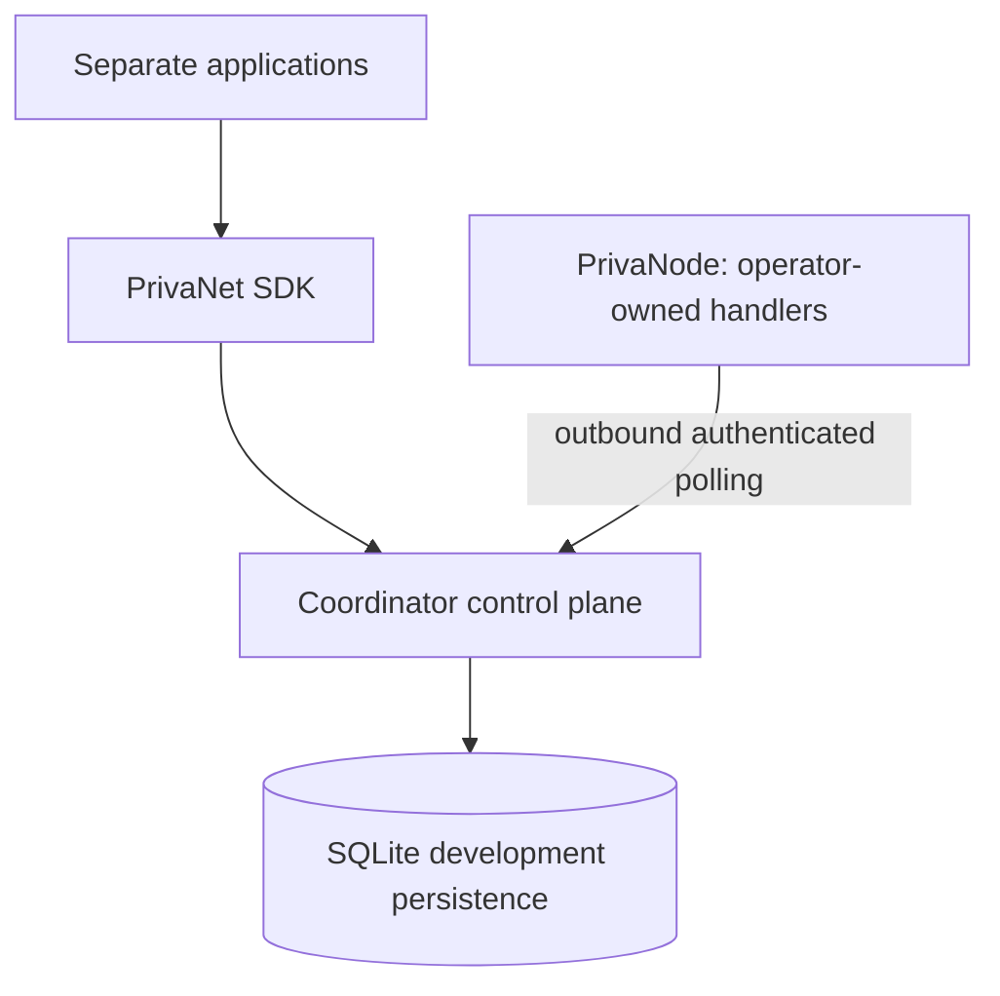

# Architecture (Core Foundation v0.1, extended through v0.2.1)

PrivaNet is application-neutral infrastructure. Every application submits work
through SDK → Coordinator → authenticated PrivaNode, including on one machine.
A local node is an ordinary, low-latency node; there is no filesystem/handler
bypass in the SDK or Coordinator.



The Coordinator is one modular service, with transport, domain service,
scheduler policy and persistence adapter separated. It manages enrollment,
node sessions, capabilities, health, scoped applications and leased jobs.
PrivaNode has no listener. It persists a private Ed25519 identity and coordinator
binding, polls for work, and invokes only locally installed registered handlers.
`system.echo.v1` returns a bounded string unchanged; `system.hashchain.v1` (v0.2.1) computes a bounded SHA-256 chain, is preemptible and checkpointable, and exists to exercise long-running behaviour. No shell, fetched executable,
script, container or arbitrary network request operation exists.

## Inspection and boundaries

The first sandbox view showed only empty read-only `.git`, `.agents` and `.codex`
placeholders; Git inspection failed there. Git became readable later in the
session: initial commit `92d5ee1` on `main`, remote
`https://github.com/doopydoop364/PrivaNet-Core.git`, with only an empty tracked
README. There were no existing implementations, development docs, ignore rules
or repository instructions. The empty README is the only tracked file modified.
PrivaDrive had uncommitted foundation work; Privaproxy was clean. Both were read
only throughout this task. Their instructions apply to those repositories.

PrivaDrive uses Node 24+, ESM, built-in tests, transactional checksum-tracked
SQLite migrations, and distinct Drive/network schemas. Its encrypted chunk and
integer accounting designs inform future boundaries, not this implementation.
Its planned in-process network composition and direct local chunk adapter must
eventually change: Drive keeps file/folder/permission/encryption semantics and
calls the PrivaNet SDK for generic storage. Document-only integration proposal:
replace physical storage access with the future PrivaNet object API when v0.4–6
exists, migrate network-owned metadata with explicit versioning, and keep Drive
vault keys out of PrivaNet. No current storage API is promised.

Privaproxy uses Node/Express, modular application routes, built-in tests,
loopback defaults, an optional password gate, cookies, in-memory sessions and
separate proxy transport credentials. These are not reusable user identities
or node credentials. A future integration uses a scoped SDK application token;
proxy sessions, cookies and browsing/media engines stay in Privaproxy.

## Structure and dependencies

- `apps/coordinator`: HTTP service, domain lifecycle, scheduler, SQLite adapter,
  append-only migrations and environment configuration.
- `apps/node`: identity files, operator configuration, daemon, fixed handlers.
- `packages/protocol`: wire schemas, versions, typed job registry; no app imports.
- `packages/shared`: bounded transport, crypto and private-file utilities.
- `packages/sdk`: small application client; imports protocol/shared only.
- `tests`: protocol/domain, HTTP integration, persistence and node identity tests.
- `docs`: architecture, protocol, security, operation and roadmap.

npm workspaces and TypeScript project references produce per-package `dist/`
outputs and declarations. Dependencies flow apps/SDK → shared → protocol.
The protocol depends only on Zod; the Coordinator never imports node handlers.
The SDK has no dependency on either service or SQLite. No empty future services,
container orchestrator, browser framework, distributed storage or ledger.

## Decisions (ADR 001)

**Problem:** establish a portable, typed, small control plane with real local
trust boundaries and durable work. **Decision:** Node 24.4+, TypeScript strict
ESM, built-in HTTP/crypto/test/SQLite, Zod strict schemas, npm workspaces.
TypeScript is justified by shared wire types; Zod supplies runtime validation
and inferred types ([official schemas](https://zod.dev/api)). TypeScript project
references preserve package build boundaries
([official documentation](https://www.typescriptlang.org/docs/handbook/project-references)).
ESLint/typescript-eslint are development-only static checks. No HTTP framework,
ORM, crypto dependency or message broker is needed. Node's synchronous SQLite
API is confined to a single-process development adapter
([Node 24 SQLite](https://nodejs.org/download/release/latest-v24.x/docs/api/sqlite.html)).

**Alternatives:** plain JS loses useful protocol typing; Rust/Go complicate the
shared JS SDK; PostgreSQL adds setup requirements before concurrency needs;
WebSockets/queues add recovery machinery for a small pull-based demo.
**Consequences:** pin/verify Node versions for releases; synchronous DB methods
limit throughput. PostgreSQL requires another Store adapter and asynchronous
transaction implementation, without changing the wire API. Single Coordinator
process per database is the supported topology. No production scale claim.

## Persistence and scheduling

Store is a domain persistence port, separate from transport and scheduling.
SQLite uses transactions, foreign keys, WAL, FULL synchronization and checksummed
migrations. Registered nodes, revocations, grants, one-use challenges, hashed
sessions, scoped app identities, jobs/results/leases and coordinator ID survive
restart. Runtime state is private and ignored. Small validated job payloads
are retained until the retention period ends; future bulk objects belong in a data plane, never job rows.

An injectable scheduler policy filters for authenticated ONLINE non-revoked
nodes, permitted capabilities and coordinator-counted active leases below the
operator's advertised slot limit (currently always one slot), a permitted resource budget that covers the job's declared estimate (v0.2), and a schedule that does not end before the job's declared duration (v0.2.1). A node keeps a running job's lease alive by renewing it (v0.2.1), so jobs may outlast one lease period. It chooses the oldest eligible
queued job when that node polls. Multiple nodes compete transactionally; no
special preference/bypass for localhost. Advertised resources are untrusted
hints, not accounting evidence. Job lifecycle/fencing is in [protocol](protocol.md).

## Future resource market (planned, not implemented)

The long-term direction is an internal market for verified useful resources, with PrivaCredits as the internal accounting unit; see [RESOURCE_MARKET.md](RESOURCE_MARKET.md) and [CREDITS.md](CREDITS.md). Architecturally it sits *in front of* the scheduler and *behind* usage measurement:

```text
Application -> SDK -> Coordinator
                        |  resource request (class, amount, max price, constraints)
                        v
                  Resource market   (planned, Phase 8: eligible supply + clearing price)
                        v
                  Scheduler         (exists: operational choice among eligible nodes)
                        v
                  PrivaNodes        (exists: adaptive budget, ask later)
                        |
                        v  verified usage records (planned, Phase 7) -> ledger (planned, Phase 8)
```

Design consequences already reflected in the code: stable versioned job identities, per-job resource estimates, dynamic node budgets in heartbeats, a replaceable scheduler behind an interface, additive-only protocol evolution and explicit versions. Not present, deliberately: any price, ask, credit or ledger field, node-to-account binding, per-attempt usage history. Market and scheduler remain separate so that economic eligibility never replaces durability, reliability or owner-limit checks, and so a single-node deployment can run the scheduler alone.

### Network Treasury layer (planned, not implemented)

A later layer, the **Network Treasury** ([TREASURY.md](TREASURY.md)), would sit beside the ledger. It is funded mainly by a bounded, visible levy on settlements and pays as a budgeted buyer for public-good work (PrivaSearch public crawling, maintenance, contributor bootstrap, emergency repair):

```text
private demand:      Application --pays-->  resource request --+
                                                               v
                                                        Resource market -> Scheduler -> PrivaNode -> verified usage
                                                               ^                                          |
public-good demand:  Treasury bucket (cap, max price) ---------+                                  settlement + levy
```

The economic stack has five separate layers (measurement, market, ledger, treasury, public-good budgeting) and treasury-funded work uses the same typed-job/market/scheduler/verification path with no privileged route. Phase 1 and 2 already carry the needed extension points (stable job IDs, application identities on jobs, replaceable scheduler, per-job resource estimates, idempotency keys, explicit protocol versions); a future payer or funding-source reference on a job would be an additive optional field. No treasury field or code exists.

### ADR 002: market design is documentation-first

**Problem:** the credits design used fixed conversion rates and manual demand multipliers, which would need hand tuning and would push economics into scheduler and job code. **Decision:** plan a resource market with explicit versioned units per class, keep it separate from scheduling, settle only verified consumption, and build measurement (Phase 7) before any market (Phase 8). Do not add speculative market code now. **Alternatives:** fixed rates plus multipliers (simple, but scarcity signals are manual and easy to misprice); a single universal credit-per-work rate (ignores that storage, bandwidth and compute have different economics); implementing credits first and measurement later (would reward unverified claims). **Security:** rewards create incentives to lie, so measurement and verification come first and are documented in the [market threat model](security.md#market-specific-threats-planned). **Consequences:** clearing mechanism, units, reference prices and reliability formulas stay open research questions until simulated; Phase 1 and 2 interfaces needed no changes, and gaps (per-attempt usage records, node-to-account binding) are listed as Phase 7 and 8 prerequisites.

### ADR 003: the treasury is an internal, levy-funded, bucketed public-good payer

**Problem:** the market pays only when a user or application demands work, but crawling, index freshness, integrity checks, repair and onboarding benefit the whole network with no single payer. **Decision:** plan a Network Treasury inside the PrivaCredits accounting, funded primarily by a bounded, versioned, visible levy that redistributes existing credits; split it into logical budget buckets with per-period caps; let it buy resources through the ordinary market and scheduler with a maximum price; support contributor bootstrap only as a match on verified useful contribution. Documentation-first; no code. **Alternatives:** mint credits for public work (inflation, hidden issuance); one unlimited pool (a runaway crawler drains everything); a privileged buyer that always outbids (destroys price signals and crowds out users); free credits per install (farmed by churn); an investment-style fund (out of scope and wrong incentives). **Security:** shared budgets attract fake jobs, onboarding farming, duplicate payouts, price pumping before purchase and compromised schedulers or policy; see the [treasury threats](security.md#treasury-specific-threats-planned). **Consequences:** it must not activate before measurement and the market exist; ledger, idempotency, transactional budgets and versioned policy are prerequisites; numbers and bucket lists remain open research questions.

## Future control/data plane

This API carries bounded JSON control messages only. Future direct node data
transfers need separately scoped authorization, transfer integrity and SSRF
review. Applications will still use the same SDK API. This release makes no
assumption that future files/index/media transit the Coordinator.
